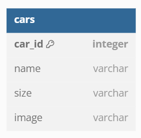

# Car Mangement Dashboard - David Nasrulloh

Car Management Dashboard is a challenge from chapter 5 SYNRGY 2023, Fullstack Web Development Binar Academy.

## Features

- List Cars
- Add new Car
- Update car data
- Delete car

## Tech

in this project, i use several tech including::
- Html
- CSS
- Javascript

and some library / framework :
- Bootstrap - CSS Framework
- NodeJS - Javascript Runtime
- ExpressJS - NodeJS HTTP Server Framework

## ERD

## EndPoint

### User (i use PORT in env 3001)
- "http://localhost:{PORT_FRONTEND}/" , get =  Index || list Cars data
- "http://localhost:{PORT_FRONTEND}/add-car" , get = handle Add Car
- "http://localhost:{PORT_FRONTEND}/add-car" , post = handle Insert Car
- "http://localhost:{PORT_FRONTEND}/edit-car/:id" , get = handle Edit Car
- "http://localhost:{PORT_FRONTEND}/update-car/:id" , post = handle Update Car
- "http://localhost:{PORT_FRONTEND}/delete-car/:id" , get = handle Delete Car

### API Backend (i use PORT in env 3000)
- "http://localhost:{PORT}/cars" , get = handle List cars
- "http://localhost:{PORT}/cars" , post = handle Insert cars
- "http://localhost:{PORT}/cars/:id" , get = handle get one car
- "http://localhost:{PORT}/cars/:id" , put = handle update car data
- "http://localhost:{PORT}/cars/:id" , delete = handle Delete car data

## How to install project
- Download or clone the repository
- install dependencies in frontend and backend with "npm install"
- configure your postgres db with data car_id, name, size, and image 
- run "npm run devback" in each backend to run project
- move others terminal and "npm run devfront" in each frontend to run project
- open "localhost:3000/" for backend testing in postman and "localhost:3001/"  and enjoy the project

##### Thanksssss
